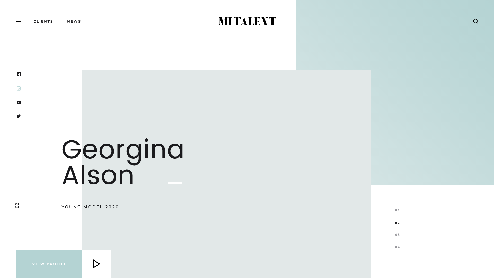

## Golden-grid-boilerplate

Golden canon grid boilerplate with example landing page.

### Table of Contents 

- [Description](#description)
- [Requirements](#requirements)
- [Libs](#libs)
- [Clone](#clone)
- [Installation and usage](#installation)
- [License](#license)

---

### Description

Golden canon grid website example created with *CSS* grids and *PUG* templating engine.
Also includes *http server* application to serve website bundle.

Landing page design:

Landing page with grid:

Design used in this example is free and could be downloaded [here](https://www.massimpressions.com/mi-talent-free-download/).
Direct download link for [PSD](https://drive.google.com/drive/folders/1xTWf2DC5Zoytavc7O6tPzxJOqFetroHp) files.
Direct link with page [previews](https://drive.google.com/drive/folders/1TOQjMEg9eqXTxMCiCpMpo4D3a99jCA0c).

---

### Requirements

- [NodeJS 12.x](https://nodejs.org/en/) 
- [NPM 6.12.0](https://www.npmjs.com/get-npm)
Not required, needed to run http sever to serve content:
- [go 1.13.3](https://golang.org/doc/install) 
Not required, needed to run in docker container:
- [Docker 19.03.5](https://www.docker.com/)

---

### Libs

Technologies used
- [Babel](http://babeljs.io)
- [PUG](https://pugjs.org/api/getting-started.html)
- [PostCSS](https://postcss.org/)
- [Webpack](https://webpack.js.org/)
- [Webpack Dev Server](https://webpack.js.org/configuration/dev-server/)
- [Gulp](https://gulpjs.com/)
- [ESLint](https://eslint.org)
- [Prettier](https://prettier.io/)
- [stylelint](https://stylelint.io)
- [Jest](https://jestjs.io/)

---
### Installation

- Clone repository:  
`git clone https://github.com/iivanovw7/golden-grid-boilerplate.git`  
- Navigate into the application directory  
`cd golden-grid-boilerplate`  
- Installing setup modules:  
`npm install`  
- Running in dev mode:  
`npm run dev`  
- Create production build:  
`npm run build`  
- Running tests:  
`npm run test`  
